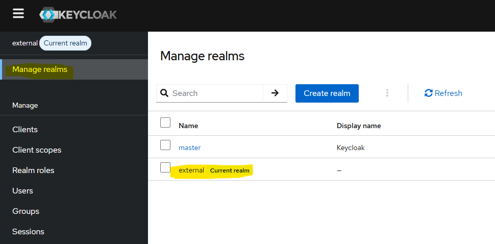
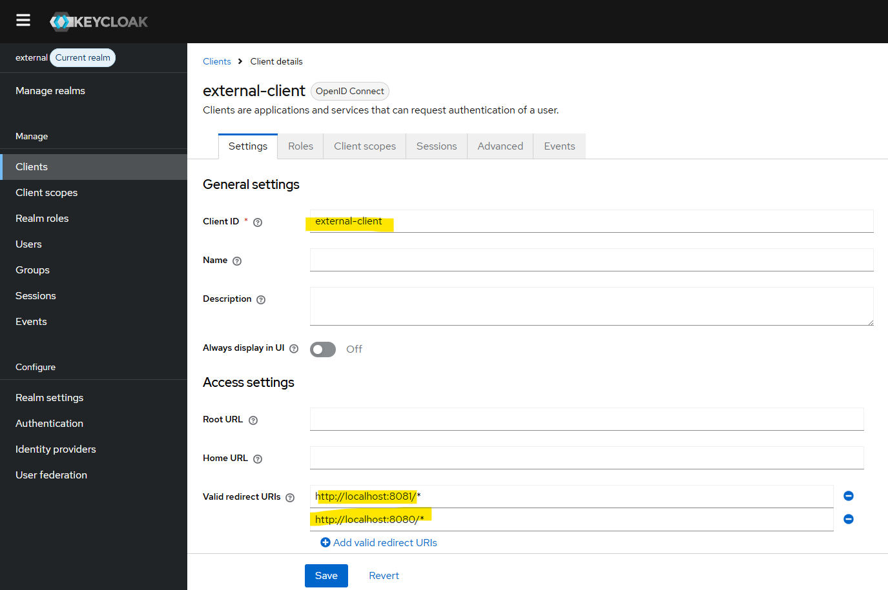
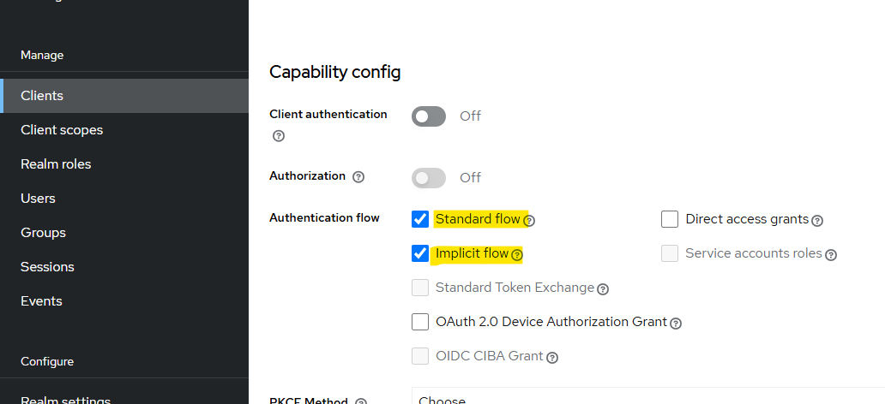
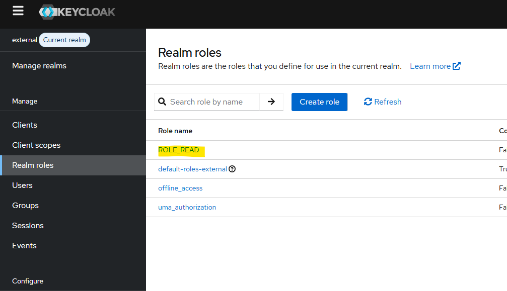
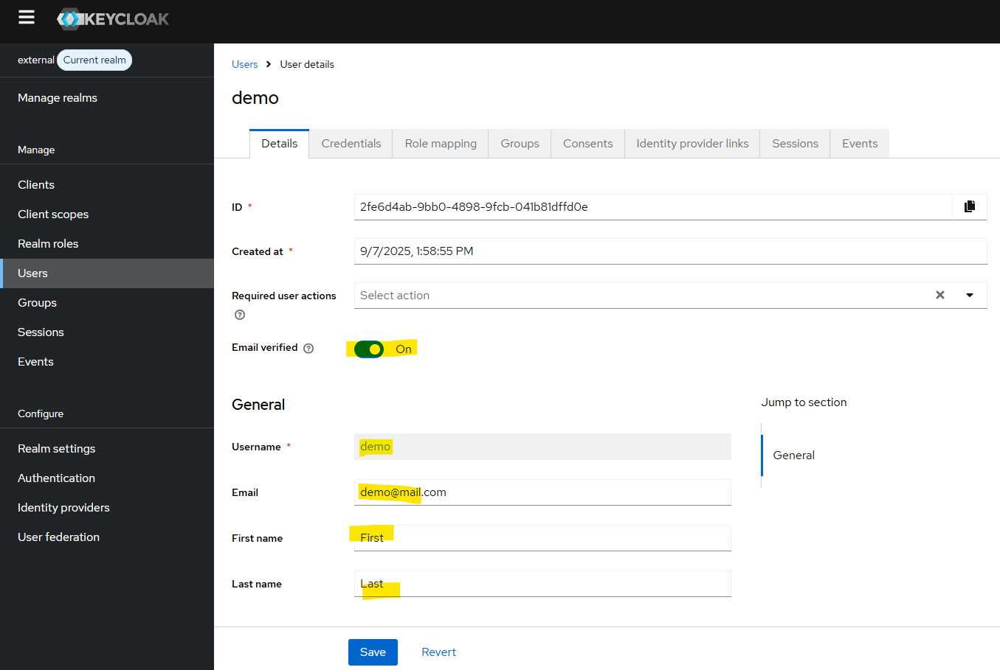
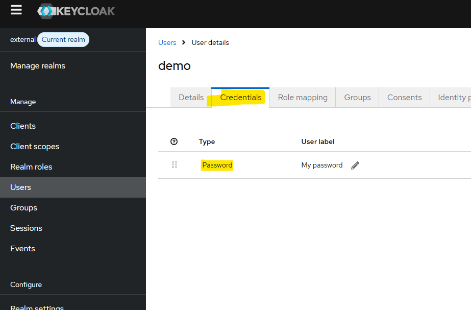
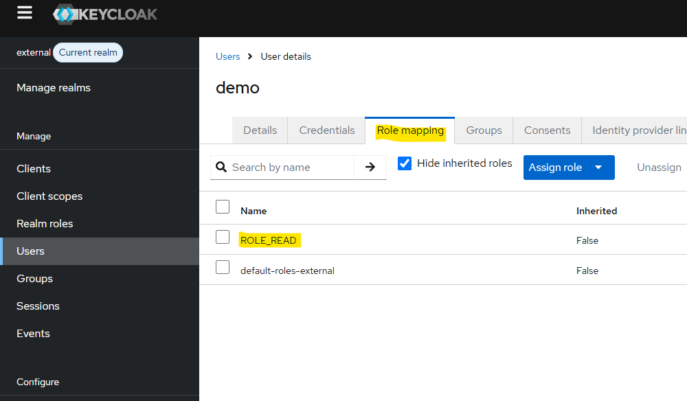
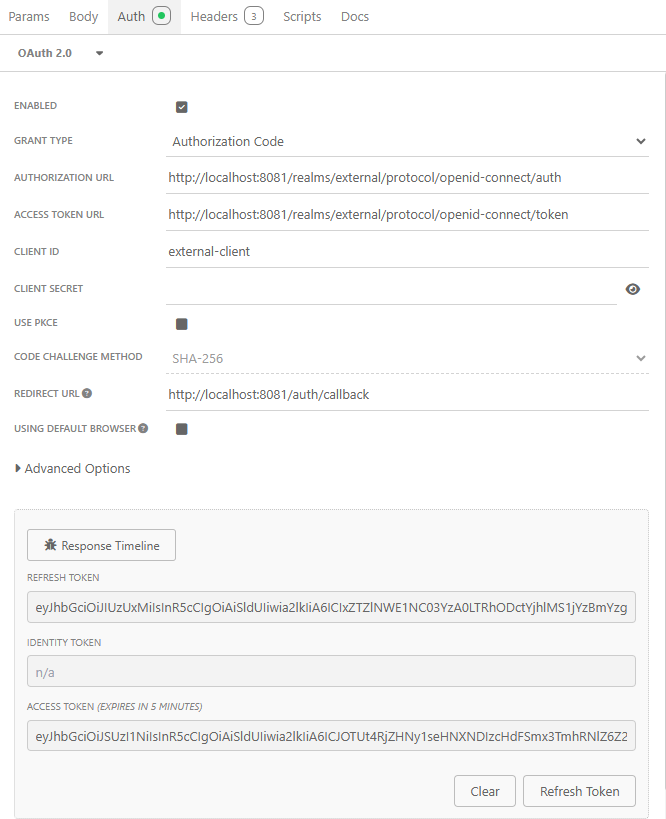

### Installation

```bash
docker-compose up -d --build
```
### Keycloak Setup

1. Open the Keycloak admin console : http://localhost:8081/
Log in using the username/password defined in the `docker-compose.yml`.

2. Create a custom realms


3. Create a client



⚠️ The Redirect URIs must match your environment (note: localhost will not work inside Docker).

4. Create a Realm roles


5. Create a user and assign roles





### Usefull endpoit
OpenID configuration : http://localhost:8081/realms/external/.well-known/openid-configuration


### Fetching a Token
From Insomnia (or Postman), configure the request as shown:


Then copy the Access Token and paste it into [jwt.io](https://www.jwt.io/) to inspect its contents.

### Swagger URL

http://localhost:8080/swagger-ui/index.html

